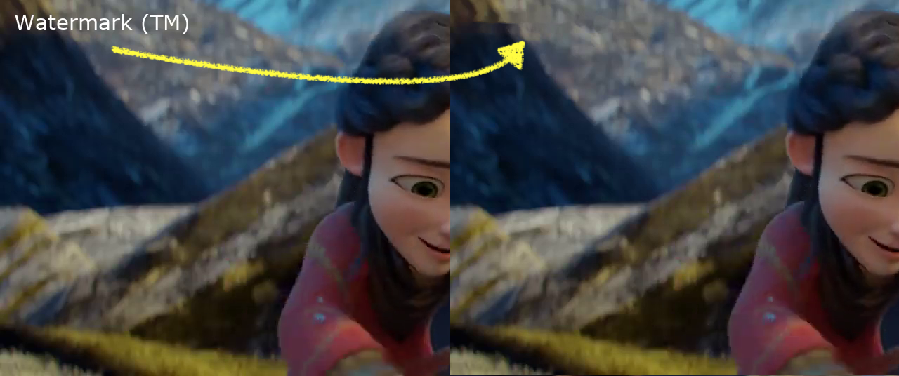

Remove static watermarks from videos with minimal setup.



Really basic, but works well enough for simple static watermarks, and can run on a laptop CPU (x3 real-time on a i5-5287U (2015 MacBook Pro), x9 real-time on a i5-8400). You can find brief explanations on how it's done [here](https://paulw.tokyo/post/basic-watermark-removal-in-videos/).

Dependencies:
```sh
# FFMPEG
installer=$([[ $(uname) == "Darwin" ]] && echo brew || echo apt)
$installer install ffmpeg

# Python libraries
python3 -m pip install numpy scipy imageio

# Optional, to fetch an example video
# if already installed, make sure youtube-dl is up to date
$installer install youtube-dl
```

Usage:
```sh
# The output will default to append "_cleaned" to the existing name,
# and use max 50 keyframes
./remove_watermark.sh /somewhere/my_video.mp4 [/somewhere/output.mp4] [max_keyframes_to_extract]
```

Tested on MacOS 10.14 (x86), MacOS 14.4 (arm) and Ubuntu 20.04
